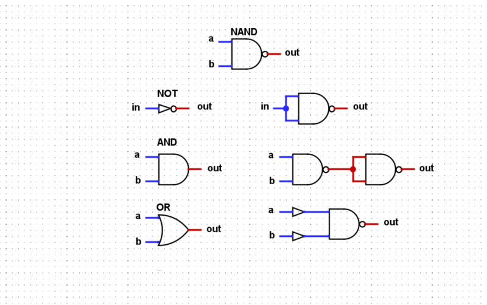
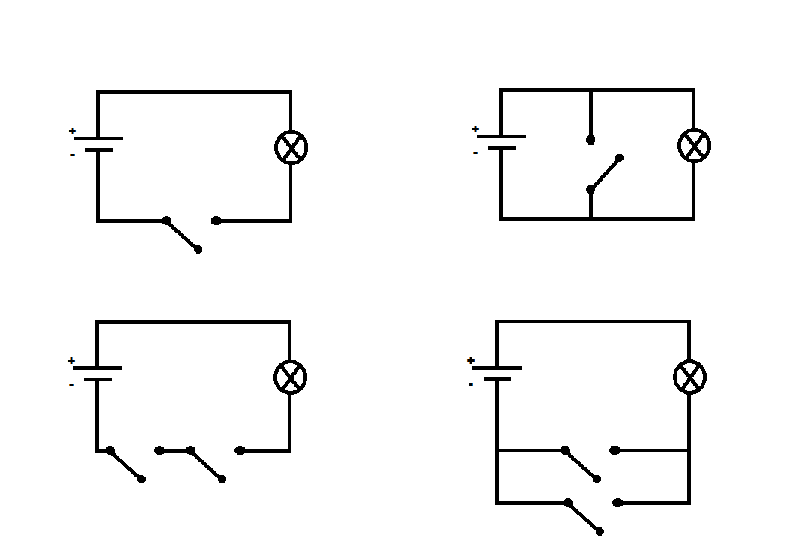

# Boolean algebra 

It's common to hear: "Computers work with ones and zeros or with binary digits". This statement is correct, but it misses the important 
explation of how can a value like 0 or 1 create something so complex as a computer. The study of boolean algebra and logic can explain with depth the why and how.

## Boolean theorems 

Any Boolean function can be expressed using only And, Or, and Not operators.
Any Boolean function can be expressed using only Nand operators.

## Boolean notation

- AND:  A Ʌ B, A + B 
- OR:   A V B, A . B
- NOT:  ¬A, !A, A'

## Boolean algebra

### Commutative laws

- AND A . B = B . A
- OR A + B = B + A

### Associative laws

- AND: A . (B . C) = (A . B) . C
- OR: x + (B + C) = (A + B) + C

### Distributive laws

- A . (B + C) = (A . B) + (A . C)
- A + (B . C) = (A + B) .(A + C)

### De Morgan's laws

- ¬(A . B)=¬A + ¬B
- ¬(A + B)=¬A . ¬B

### Indemptent laws

- A . A = A
- A + A = A

These properties can be used to simplify boolean expressions. Why is it useful? Because its possible given a truth table synthesize a equivalent boolean expression. That can be done by using the rule of the sum of products https://www.allaboutcircuits.com/textbook/digital/chpt-7/converting-truth-tables-boolean-expressions/

## Boolean functions

|     INPUT           |        A         | 0 0 1 1  |
|---------------------|------------------|----------|
|     INPUT           |        B         | 0 1 0 1  |

| Function       | Expression       | Output  |
|----------------|------------------|----------|
| Constant 0     | 0                | 0 0 0 0  |
| Constant 1     | 1                | 1 1 1 1  |
| Equivalence    | (A.B)+(A'+B')    | 1 0 0 1  |
| Not A          | A'               | 1 1 0 0  |
| Not B          | B'               | 1 0 1 0  |
| And            | A.B              | 0 0 0 1  |
| Or             | A+B              | 0 1 1 1  |
| Nand           | (A.B)'           | 1 1 1 0  |
| Nor            | (A+B)'           | 1 0 0 0  |
| Xor            | (A.B')+(A'.B)    | 0 1 1 0  |
| If B then A    | (A+B')           | 1 0 1 1  |
| If A then B    | (A'+B)           | 1 1 0 1  |

## Logic gates diagrams 

## Proving the theorems 

By reacreating the NOT, AND and OR from NAND its possible to prove that both theorems are valid by using an existance proof.

- NOT is created by only inputing one varible into the terminals of a NAND gate.
- AND is created by inputing the output of a NAND gate into the terminals of another NAND gate.
- OR is  created by inputing x and y into NOT gates followed by a NAND gate

## Why?

It is much simpler to construct ANDs, ORs and NOTs with switches, so why would someone build logic gates with nand? A possible explanation is standardtization. All the other gates are built in different ways, but when a manufacture uses the same building block over and over, even if the design requires more parts, the standardtization winns on volume and easy of manufacture.

## Multiplexer and Demultiplexer

The multiplexor was constructed by using the truth table and extracting the boolean expression using the sum of products rule and than reducing the expression using the boolean identies. 

| a   | b   | sel | out |
| --- | --- | --- | --- |
| 0   | 0   | 0   | 0   |
| 0   | 0   | 1   | 1   |
| 0   | 1   | 0   | 0   |
| 0   | 1   | 1   | 1   |
| 1   | 0   | 0   | 1   |
| 1   | 0   | 1   | 0   |
| 1   | 1   | 0   | 1   |
| 1   | 1   | 1   | 1   |

### Expression

Sum of Products Expression: (ABC′)+(AB′C)+(A′BC)+(ABC)
Expression simplified: AC′=BC

| sel |  a   |  b  | 
| --- | ---  | --- | 
| 0   | in   | 0   | 
| 1   | 0    | in  |

### Expression 

1º (SEL'A) 
2º (SELB)

The demultiplexer taught an important lesson. It can be constructed from the truth table, as the other components, but it should be viewed as independent parts, not summed together as the multiplexer was. 

## 2's Complement

In order to represent positive and negative numbers, Jhon von Neuman suggested the use of binary complements, the leftmost bit is called the sign bit, if it is equal to 1, it means that is a negative number. By using the 2's complement it's possib  carry additions and subtractions, with the same logic circuit, reducing the computer's archicteture complexity. Look the binary numbers bellow they are 4 and -4.

00000100 : Positive number
11111100 : Negative number 

The ideia of complemente is that if a number and its complement are added together, the result must be zero. 

-4+4 = 0

### 2's complement algorithm 

To find the binary complement of a number invert the bits and add +1 to the result.

01010 = 10

10101 : Invert

10101
+   1 : +1
-----
10110 : -10 